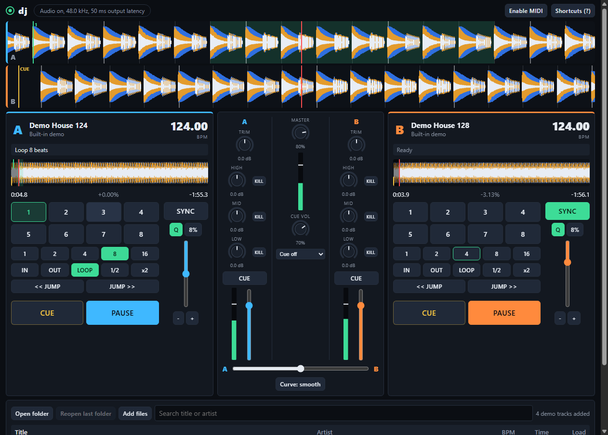

# dj

A two-deck DJ mixer that runs in the browser: beat-matched playback, a 3-band
isolator EQ with true kills, a filter knob per channel, crossfader, BPM
detection and sync, a beat-phase meter, hot cues, loops, a music library and
headphone cue. No install, no account, no upload: your music stays
on your machine.

> **Disclaimer.** This software is provided **AS IS**, without warranty of any
> kind, express or implied. **Use it entirely at your own risk.** The authors
> accept no liability for any loss or damage arising from its use, including
> data loss or corruption, hardware damage, unbootable systems, business
> interruption, or any indirect or consequential damages. You are responsible
> for choosing the files and devices you use with it, for keeping tested
> backups of your music, and for being authorised to play the material you
> load. It is not certified for regulated, forensic, safety-critical or
> high-assurance use, or for professional broadcast or live-event duty.
> **Protect your hearing:** start with the master and headphone levels low,
> and keep them at a safe volume. The [LICENSE](LICENSE) (MIT) is the governing
> text and prevails wherever it and this summary differ.



## Quick start

```bash
npm install
npm run dev
```

Open the address Vite prints (usually <http://localhost:5173>). Browsers keep
audio paused until you interact with the page, so click anywhere first.

No music at hand? Open `http://localhost:5173/?demo=1` to load two built-in
demo tracks (124 and 128 BPM), or use the demo rows at the top of the library.

## Using it

**Loading tracks.** *Open folder* scans a music folder (Chrome and Edge);
*Add files* picks individual files (every browser). Then press **A** or **B**
on a row, double-click a row, drag a row onto a deck, or drop a file from your
desktop straight onto a deck. Tracks are analysed on first load (waveform,
BPM, beat grid); the results, cue point and hot cues are cached in the
browser, so the next load is instant. *Reopen last folder* rescans the folder
from your previous session.

**Decks.**

| Control | What it does |
|---|---|
| PLAY / CUE | CDJ style. CUE while playing returns to the cue point and stops. CUE while stopped sets the cue point there and plays while held; release to snap back, or press PLAY during the hold to keep playing. New tracks cue to their first beat automatically |
| Overview waveform | Click or drag to jump; with Q on, a playing deck keeps its beat phase |
| SYNC | Matches this deck's tempo and beat phase to the other deck, and keeps following its tempo. Half and double time are handled (87 syncs to 174). Moving a synced deck's tempo fader moves both decks. Press again to release |
| /2, x2 | Correct a BPM read at half or double time |
| Tempo fader | Top is slower, bottom is faster; double-click resets. The range button cycles 8%, 16%, 50% |
| `-` / `+` | Hold to nudge the tempo 4% while beat-matching by ear |
| Q | Quantize: cues and loops snap to the beat grid |
| Pads 1 to 8 | Hot cues, each with its own colour: an empty pad stores the position, a set pad jumps to it (keeping the beat phase with Q). On a stopped deck a set pad plays while held. Shift+click or right-click clears |
| 1, 2, 4, 8, 16 | Auto loop of that many beats; press the same size again to exit |
| IN / OUT / LOOP | Manual loop points; LOOP toggles the loop (or re-engages the last one) |
| 1/2, x2 | Halve or double the active loop (or the loop size) |
| JUMP | Move by the loop size in beats; an active loop moves with you |

**Mixer.** Per channel: trim, a 3-band isolator EQ (-26 dB to +6 dB, crossovers
at 250 Hz and 2.5 kHz) whose KILL buttons remove the band completely, a FILTER
knob (left is low-pass, right is high-pass, centre is off), headphone CUE, fader
and level meter. In the middle: master level with a LIMIT light that shows when
the safety limiter is working (turn something down), headphone level and
routing, crossfader and its curve (*smooth* is equal power; *sharp* is a
scratch cut). Knobs: drag up or down (Shift for fine control), scroll, or use
the arrow keys; double-click or Home resets.

**Between the waveforms**, the phase meter shows how far deck B's beat is from
deck A's ("In phase", or "B 12 ms ahead") and each deck's bar and beat, so you
can beat-match by ear with the nudge buttons and check it by eye. The `+` and
`-` buttons (or `=` and `-` on the keyboard) zoom both waveforms together. A
playing track with under 30 seconds left flashes its remaining time and
waveform red.

**Headphone cue** needs a second output. Choose *4-channel* if your audio
interface or controller has four outputs (master on 1/2, cue on 3/4), or
*Split* to share one stereo output with cue in the left ear and master in the
right, using a splitter cable.

**Keyboard.** Press `?` in the app for the full list.

| Deck A | Deck B | Action |
|---|---|---|
| Q | P | Play / pause |
| W | O | Cue (hold to preview) |
| E | I | Sync |
| R | U | Loop on / off |
| D / F | H / J | Halve / double loop |
| Z / X | N / M | Beat jump back / forward |
| A / S | K / L | Nudge slower / faster (hold) |
| 1 2 3 4 | 7 8 9 0 | Hot cues 1 to 4 (hold on a stopped deck; Shift clears) |

Left and Right arrows move the crossfader; Shift+Down centres it. `=` and `-`
zoom the waveforms. Keys are matched by position, so the layout is the same on
non-QWERTY keyboards. Shortcuts keep working after you touch a fader, and pause
while the shortcut list is open.

**MIDI.** *Enable MIDI* connects any controller. The built-in mapping follows
the common Pioneer DDJ layout (deck A on MIDI channel 1, deck B on channel 2).
It has **not** been verified on real hardware; the status line in the top bar
shows every message the controller sends and whether it is mapped, so a
mismatch is easy to spot.

## Browser support

| Browser | Status |
|---|---|
| Chrome, Edge | Everything, including *Open folder* and *Reopen last folder* |
| Firefox | Everything except folder access: use *Add files* or drag and drop |
| Safari | Should work (Web Audio, AudioWorklet); not tested |

Which audio formats load depends on the browser's decoders: MP3, WAV, AAC/M4A,
FLAC and Ogg/Opus work in current Chrome and Edge.

## Development

```bash
npm test          # unit tests: BPM detection, sync maths, mixer curves
npm run lint      # ESLint
npm run build     # typecheck + production build into dist/
npm run preview   # serve dist/ on http://localhost:4173
npm run e2e       # drive the built app in headless Chrome/Edge (run preview first)
```

`npm run e2e` clicks through the real app and checks what the audio does, not
just what the page shows (36 checks): audio reaches the master bus, beat grids
match the demo tracks, SYNC lands in phase and stays there through tempo
changes and hot-cue jumps, loops wrap inside the audio thread and beat jumps
move them exactly, the low kill removes the low band, CUE previews while held,
shortcuts survive touching a fader, a real WAV file decodes and analyses, and a
page reload restores the analysis and hot cues from the cache.
It needs Chrome or Edge installed (set `CHROME_PATH` if it is not found).

### How it works

- **Playback** runs in an AudioWorklet (`src/audio/worklets/deck-processor.ts`)
  that owns each track's PCM, a fractional read head and the playback rate,
  with Hermite interpolation. Loops and jumps happen inside the audio thread,
  so they are sample-accurate, and every discontinuity is de-clicked.
- **Sync** (`src/audio/sync.ts`) matches tempo, then moves the follower's read
  head to the leader's beat phase. A seek carries the audio-clock time its
  target refers to, so the audio thread compensates for however late it lands.
- **Analysis** (`src/analysis/`) runs in a Web Worker per deck, in single
  streaming passes, so memory stays small on long tracks: band-split waveform
  peaks, and BPM from a normalised multi-band onset envelope. Candidate tempos
  come from its autocorrelation over a 40 s excerpt, an off-beat check settles
  half versus double time, and a comb over the whole track, with a step scaled
  to its length, sets the final tempo and grid. Results are cached with a
  version number, so an improved detector re-analyses old entries.
- **Mixer** (`src/audio/mixer.ts`, `engine.ts`) is plain Web Audio: gain, a
  Linkwitz-Riley isolator EQ, resonant filters, an equal-power crossfader, and
  limiters on the master and headphone buses.
- **Loops** crossfade for 3 ms at the wrap, so they do not click.

## Not yet

Key lock (tempo change without pitch change), effects, musical key detection,
recording the mix, a MIDI learn screen, background analysis of the whole
library, and stem separation. The BPM detector can still misread a track whose
pattern is genuinely ambiguous between two tempos (85 BPM house with off-beat
hats reads as 170, for example): use the /2 and x2 buttons.

## License

MIT, see [LICENSE](LICENSE).
